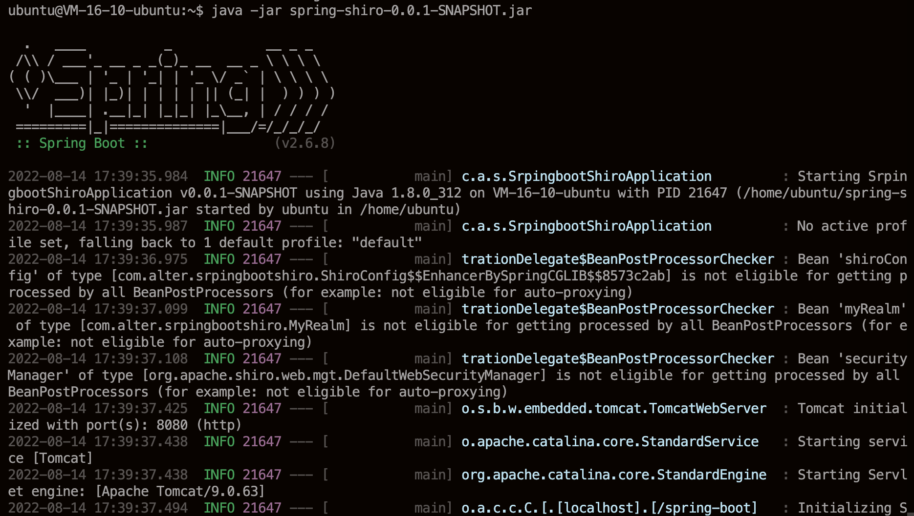
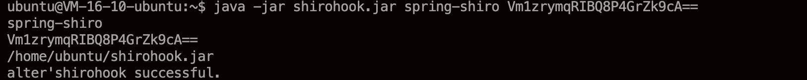
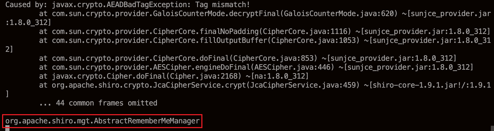
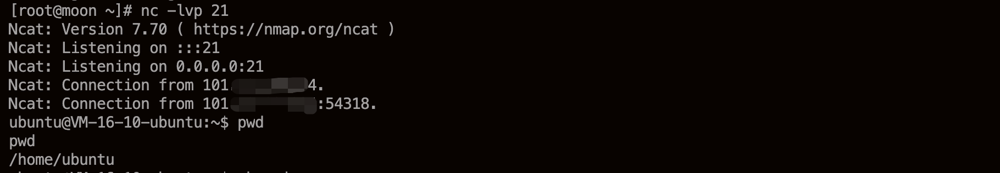

## About The Project

这是一个Shiro后渗透工具。
使用的前提是能够上传jar包并执行相关命令。满足上述条件，利用此项目可以达到全平台修改shiro加解密密钥的效果。

已测平台：
* `macOS 12.4`
* `ubuntu 18.04`
* `Red Hat 8.4.1-1`


## Usage
测试环境如下
* `ubuntu 18.04`
* `openjdk version "1.8.0_312"`

首先开启包含shiro的web服务



然后执行shirohook，命令示例如下

```
java -jar shirohook.jar spring-shiro Vm1zrymqRIBQ8P4GrZk9cA==
```
可以看到显示`hook`成功



服务端这边上面的报错是由于hook之前，使用错误的密钥造成的解密失败的错误（这里没有进行异常处理，直接让错误暴露出来)



成功hook后，由`agentmain`中的方法打印出hook的类，即`org.apache.shiro.mgt.AbstractRememberMeManager`
反弹shell测试成功




:warning: 初次使用一定要先发送带`rememberMe`的数据包，让web服务加载AbstractRememberMeManager类及其方法
:warning: 不同的平台（Windows、Linux、OS X 等），不同的版本的 JRE，能正常使用的 `tools.jar` 的版本都是不同的，因此在使用的时候，需要注意匹配。
